# Contributor Workflows

This document consolidates all workflow diagrams for FreeMind CE contributors. Every diagram here
describes a real, enforced process — not aspirational guidelines. Read [CONTRIBUTING.md](../CONTRIBUTING.md)
for the full rules and policy text that accompanies these diagrams.

---

## Section 1: Master Overview

The full end-to-end path from "I want to contribute" to "code is shipped in a release":

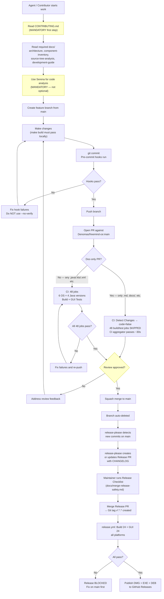

---

## Section 2: Contributor Type Workflows

### Who Can Contribute

Access level determines how you interact with the repository:

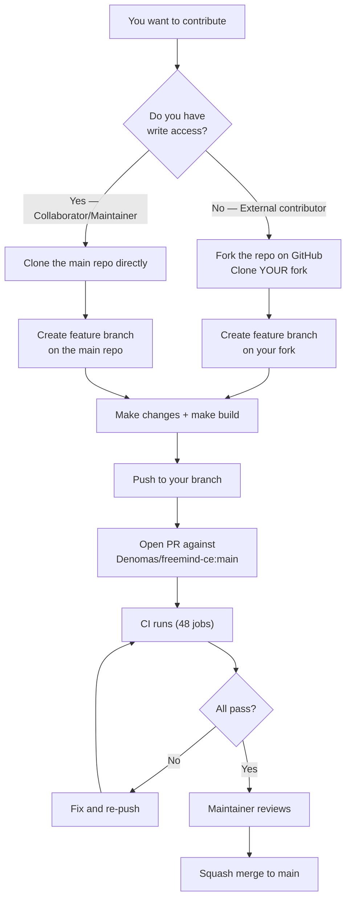

| Contributor Type | Access | How to Submit | CI Behavior | Review Required |
|-----------------|--------|---------------|-------------|-----------------|
| **External (open source)** | None — fork the repo | PR from fork | CI runs, secrets NOT available | Maintainer approval |
| **Collaborator** | Write — invited by maintainer | PR from repo branch | CI runs, full access | Maintainer or peer approval |
| **Maintainer** | Admin | PR from repo branch | CI runs, full access | Self-review (CI is the gate) |
| **AI Agent** (Claude Code, etc.) | Via maintainer's credentials | PR from repo branch | CI runs, full access | Maintainer MUST review the diff |
| **Bots** (Dependabot, release-please) | App token | Auto-generated PR | CI runs automatically | Maintainer approval for merge |

### For External Contributors (Fork Workflow)

```bash
# 1. Fork on GitHub UI, then clone your fork
git clone https://github.com/YOUR-USERNAME/freemind-ce.git
cd freemind-ce

# 2. Add upstream remote
git remote add upstream https://github.com/Denomas/freemind-ce.git

# 3. Create feature branch
git checkout -b feat/your-feature

# 4. Make changes, build, and test
make build    # Must pass before committing

# 5. Push to your fork and open PR
git push -u origin feat/your-feature
# Then open PR on GitHub: YOUR-USERNAME/freemind-ce → Denomas/freemind-ce:main
```

> CI secrets are NOT available in fork PR runs. This is a GitHub security measure. All tests still
> run normally since they don't require secrets.

### For Collaborators and Maintainer

```bash
# Clone directly (you have write access)
git clone https://github.com/Denomas/freemind-ce.git
cd freemind-ce

# Create feature branch (never commit directly to main)
git checkout -b feat/your-feature

# Make changes, build, and test
make build

# Push and create PR
git push -u origin feat/your-feature
gh pr create --title "feat: your feature" --body "Description"
```

### For AI Agents

AI agents must follow the same process as human contributors with two additional mandatory gates
— Serena usage and explicit maintainer review of the generated diff:

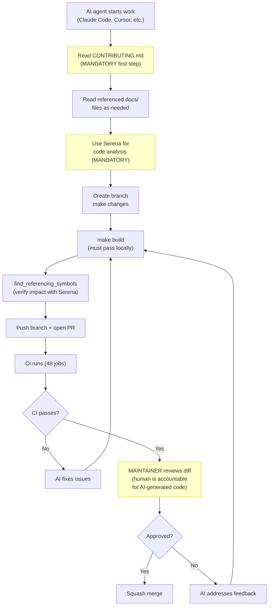

### First-Time Contributor Flow

GitHub pauses CI for first-time contributors until a maintainer verifies the code is safe to run:

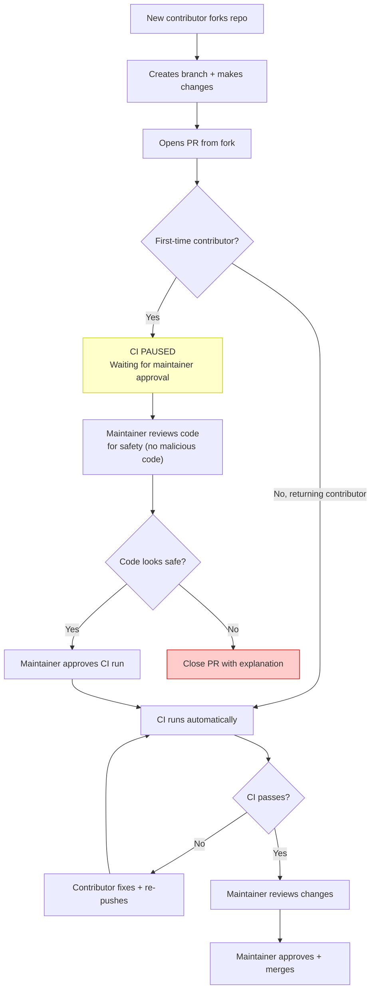

---

## Section 3: Blocked Actions

### BLOCKED vs ALLOWED

Direct push to main is blocked for everyone — maintainer included. This is enforced by GitHub
Ruleset with an empty bypass list. There are no exceptions, no hotfix bypasses, no admin overrides.

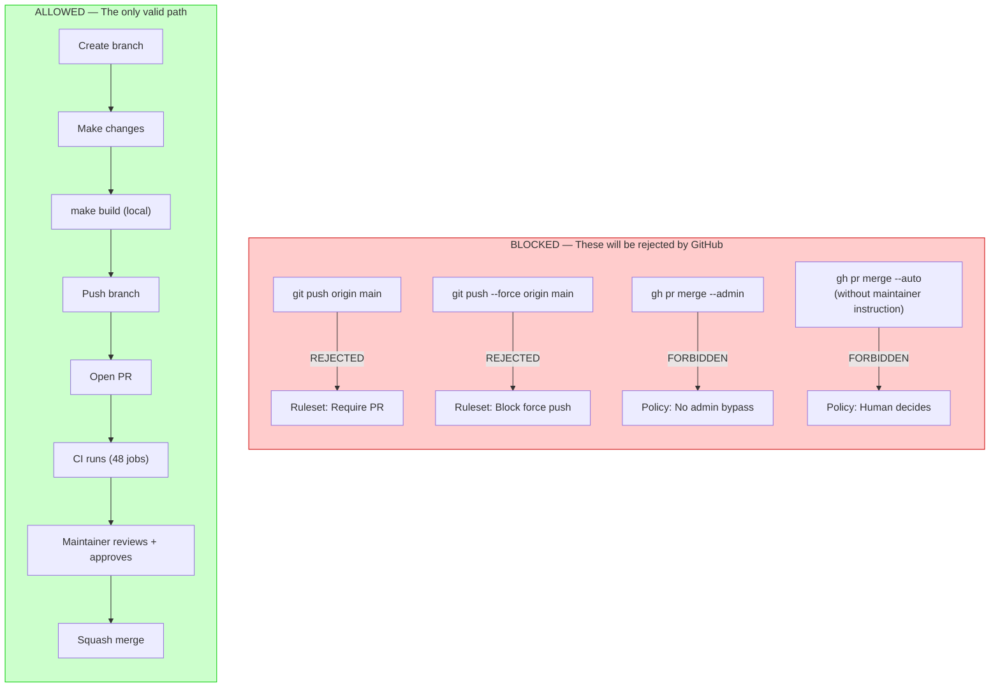

### Forbidden Actions

| Action | Why Forbidden |
|--------|--------------|
| `git push origin main` | GitHub Ruleset blocks all direct pushes |
| `git push --force origin main` | Ruleset blocks force push to protected branch |
| `gh pr merge --admin` | Policy: no admin bypass, ever |
| `gh pr merge --auto` without explicit maintainer instruction | Policy: human decides when to merge |
| Merging with any failing CI job | Zero-tolerance policy — all 48 must be green |
| `@SuppressWarnings` | Fix root causes, never suppress |
| Editing files in `generated-src/` | Regenerate with `make jaxb` instead |
| Committing `auto.properties` | Runtime-generated user config, never committed |
| Committing `*.class` files | Build artifacts, blocked by pre-commit hook |
| Ignoring `*.jar` in `.gitignore` | ~90 tracked JARs in `lib/` are required dependencies |

---

## Section 4: Hotfix Flow

There is no shortcut for emergencies. The fastest path is still a PR. Estimated total time from
bug discovery to merge: approximately 12 minutes.

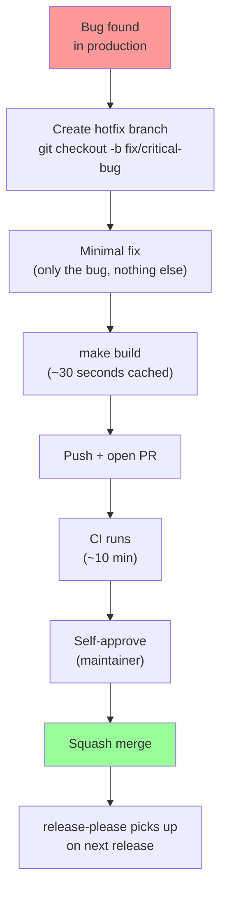

Never bypass CI even for critical bugs. The 10-minute CI run is not negotiable.

---

## Section 5: Conflict Resolution

When two PRs modify the same file, the second one needs to be updated after the first merges:

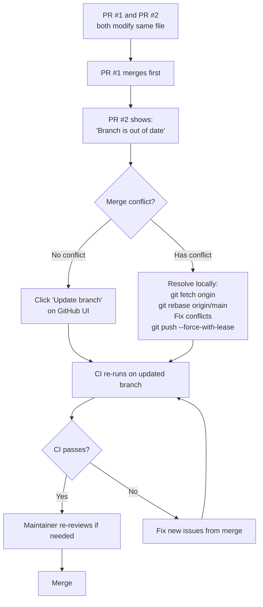

Use `--force-with-lease` instead of `--force` when rebasing — it prevents accidentally overwriting
commits pushed by someone else after your last fetch.

---

## Section 6: CI Pipeline

### CI Path Filtering Flow

The `Detect changes` job determines whether a PR contains only documentation changes. If so, the
48-job build/test matrix is skipped and the `CI` aggregator passes immediately (~30 seconds).
Non-PR events (push to main, `workflow_call` from release-please) always run the full matrix.

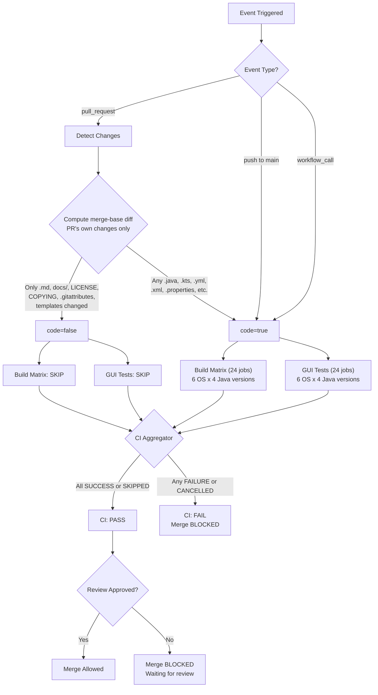

### Doc-Only File Patterns

Changes to ONLY these files cause the 48-job matrix to be skipped:

| Pattern | Examples |
|---------|---------|
| `**/*.md` | `README.md`, `CONTRIBUTING.md`, `CLAUDE.md`, `docs/*.md` |
| `docs/**` | Any file under `docs/` directory |
| `LICENSE`, `COPYING`, `.gitattributes` | License and git config files |
| `.github/ISSUE_TEMPLATE/**` | Issue templates |
| `.github/PULL_REQUEST_TEMPLATE/**` | PR templates |
| `.github/release-notes-template.md` | Release notes template |

Any other file change (`.java`, `.kts`, `.yml`, `.xml`, `.properties`, etc.) triggers the full
48-job matrix.

### Path Filtering Detection Method

The `Detect changes` job uses `git merge-base` to compute the common ancestor between the PR branch
and main, then checks only the PR's own commits — not commits merged into main since the branch
was created. This prevents false positives when main has recent merges.

```bash
# Correct: merge-base ensures only PR's own changes are checked
BASE=$(git merge-base "$PR_BASE_SHA" "$PR_HEAD_SHA")
git diff --name-only "$BASE..$HEAD" -- ':!**/*.md' ':!docs/**' ...
```

---

## Section 7: Branch Workflow

### PR Lifecycle

All changes go through a feature branch and Pull Request. Squash merge produces a clean linear
history on main. The branch is automatically deleted after merge.

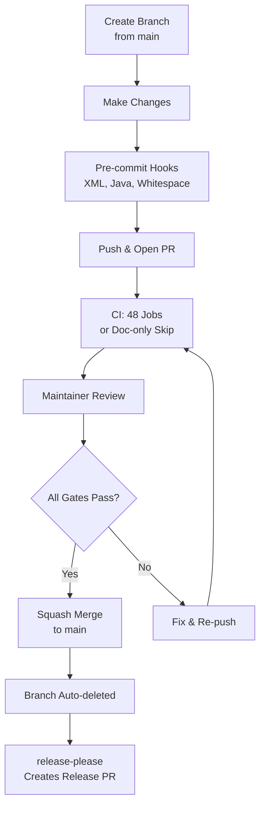

- All changes via feature branch → Pull Request → main
- No direct push to main (enforced by GitHub Ruleset)
- PR requires: `CI` check pass + code review (single required check, not 48 individual)
- Squash merge only — clean linear history on main

---

## Section 8: Bot Lifecycle

Dependabot and release-please are the two bots that open PRs automatically. Both require
maintainer review before merge.

```mermaid
flowchart TD
    subgraph Dependabot
        DA["Dependabot detects<br>new dependency version"] --> DB["Opens PR automatically"]
        DB --> DC["CI runs (48 jobs)"]
        DC --> DD{CI passes?}
        DD -->|Yes| DE{Version type?}
        DD -->|No| DF["Maintainer investigates<br>See Dependency Update Protocol"]

        DE -->|Patch/Minor| DG["Maintainer reviews changelog<br>Approves PR"]
        DE -->|Major| DH["Maintainer follows<br>Major Update Protocol<br>(migration guide, local test)"]

        DG --> DI["Merge"]
        DH --> DI
    end

    subgraph ReleasePlease["release-please"]
        RA["Code merged to main"] --> RB["release-please creates/updates<br>Release PR with CHANGELOG"]
        RB --> RC["CI runs on Release PR"]
        RC --> RD{CI passes?}
        RD -->|No| RE["Fix failures on main first<br>release-please will update PR"]
        RD -->|Yes| RF["Maintainer applies<br>Release Checklist"]
        RF --> RG{Checklist complete?}
        RG -->|No| RH["Complete missing items"]
        RH --> RF
        RG -->|Yes| RI["Maintainer merges Release PR"]
        RI --> RJ["Tag created → release.yml<br>→ DMG/EXE/DEB published"]
    end
```

---

## Section 9: Dependency Updates

Dependabot opens PRs when new versions of dependencies are available. The decision tree below
determines the required review depth. CI passing alone is never sufficient — human review is
always required. For the full protocol, see [docs/merge-release-safety.md](merge-release-safety.md).

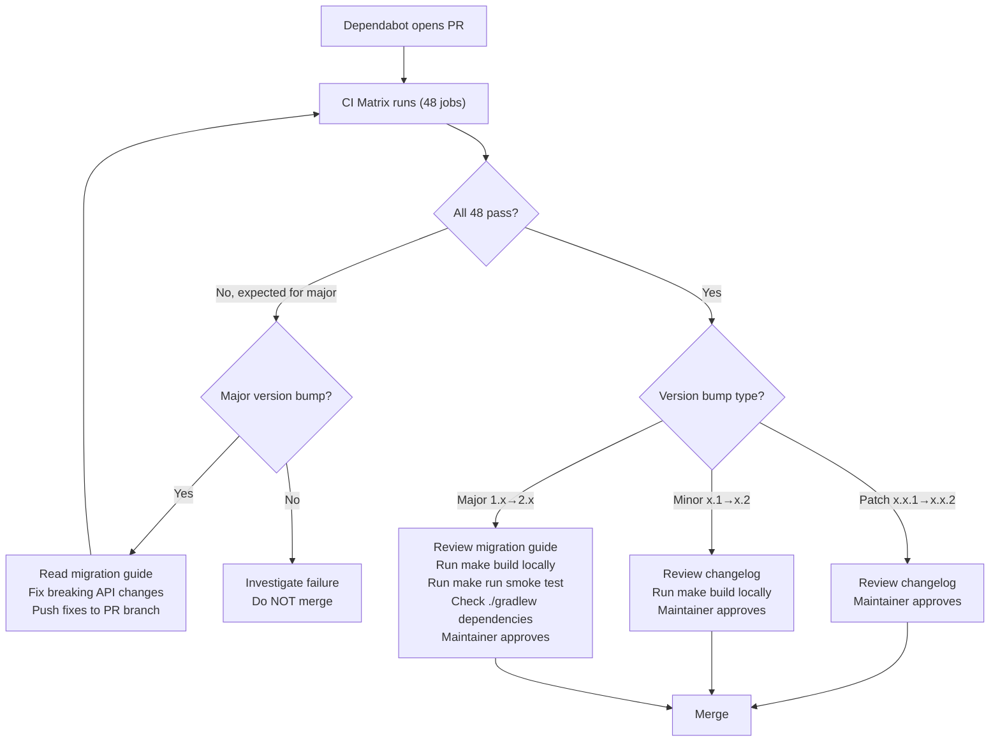

- **Patch** (x.x.1→x.x.2): CI passes + changelog review + maintainer approve
- **Minor** (x.1→x.2): Above + local `make build` verification
- **Major** (1.x→2.x): Above + migration guide + API fix + `make run` smoke test

---

## Section 10: Release Gating

The release pipeline has multiple gates. Any failure at any stage blocks the release completely.
There is no manual override. For the full checklist, see
[docs/merge-release-safety.md](merge-release-safety.md).

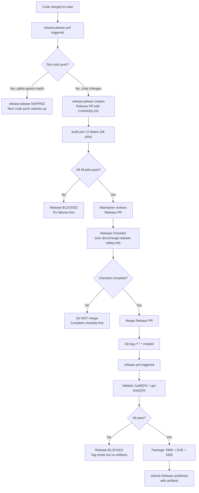

> `release-please.yml` and `scorecard.yml` use `paths-ignore` on push triggers. Doc-only pushes
> to main skip these workflows entirely. The next code push catches up because release-please
> accumulates all commits since the last release.

---

## Section 11: Security Incident

When a secret is detected, the response depends on where it was caught. Rotate the credential
immediately regardless of where the detection occurred.

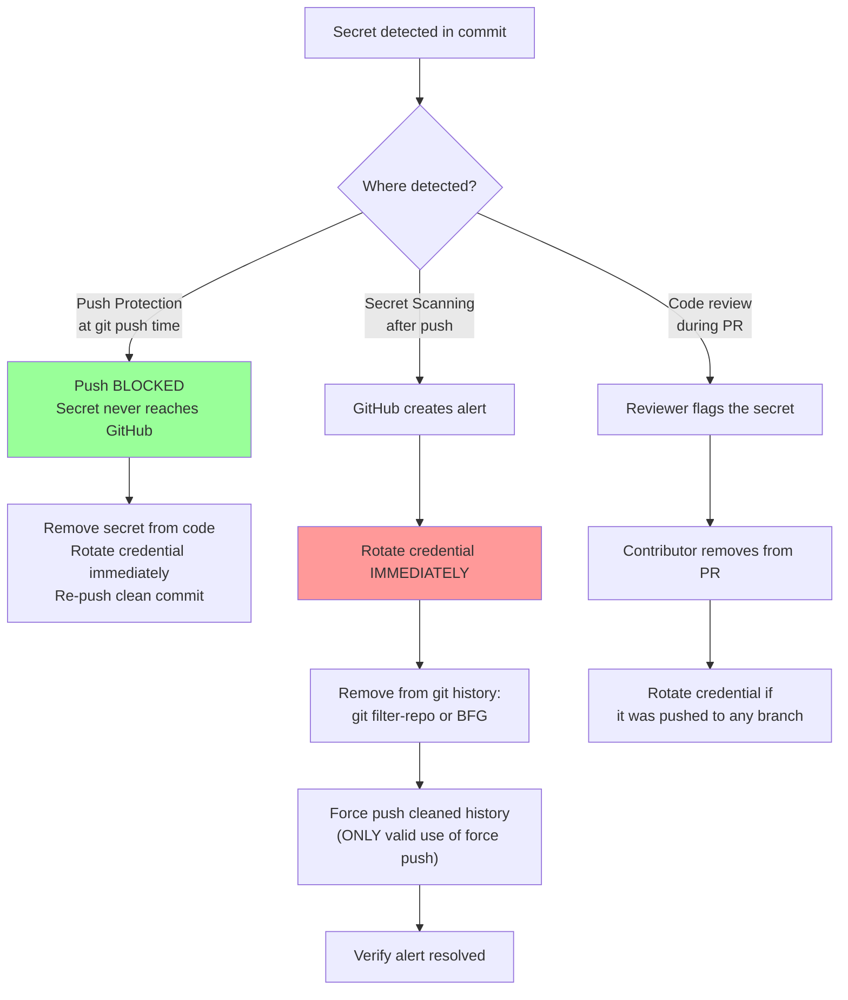

---

## Section 12: Pre-Commit Hooks

At every `git commit`, pre-commit runs a sequence of checks. Any single failure rejects the
commit. Never use `--no-verify` — fix the root cause instead.

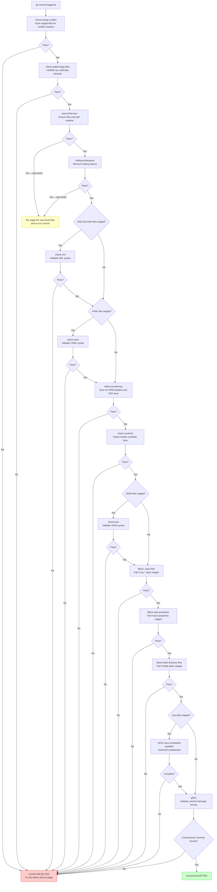

---

## Section 13: PR Review Checklist

When a maintainer reviews a PR, the following checklist must be completed before approval.
Every item is a hard requirement — not a suggestion.

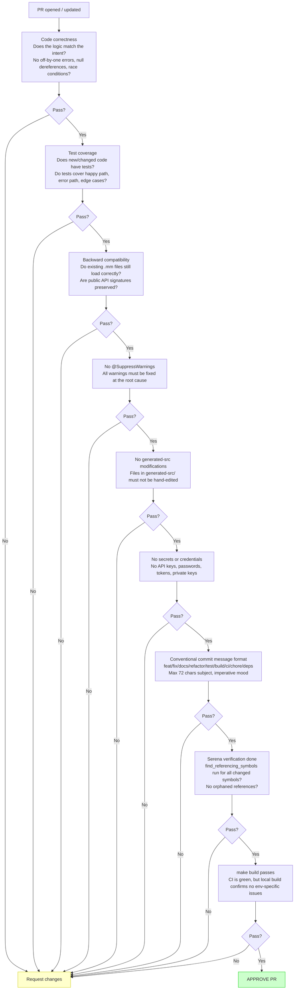

---

## Section 14: Commit Message Decision Tree

Use the type prefix that most accurately describes the change. When in doubt, choose the prefix
for the primary effect — not the mechanism.

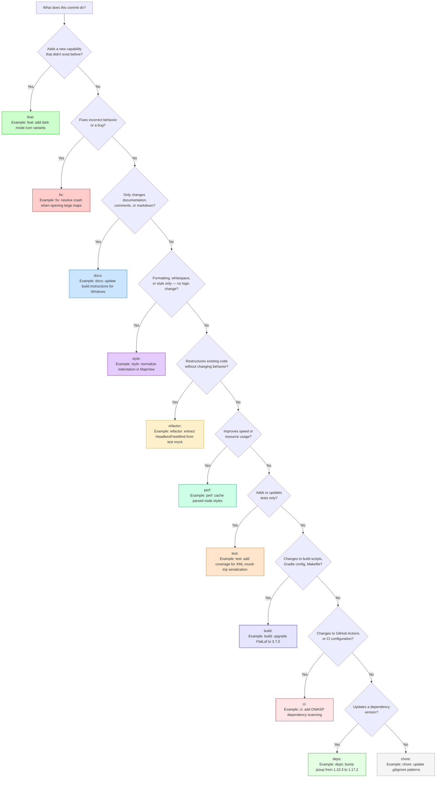

**Breaking changes (`feat!:`) are FORBIDDEN.** FreeMind CE preserves full backward compatibility with every `.mm` file ever created. We do not break the past. The `!` suffix and `BREAKING CHANGE` footer must never be used. See [CONTRIBUTING.md — Project Philosophy](../CONTRIBUTING.md#project-philosophy).

**Allowed types in full:** `feat`, `fix`, `docs`, `style`, `refactor`, `perf`, `test`, `build`,
`ci`, `chore`, `revert`, `deps` — enforced by gitlint on every commit.

---

## Section 15: Parallel Work / Overlapping PRs

When you discover that another open PR overlaps with your work, follow this decision tree.
For the full binding rules, see [CONTRIBUTING.md — Parallel Work Protection](../CONTRIBUTING.md#parallel-work-protection).

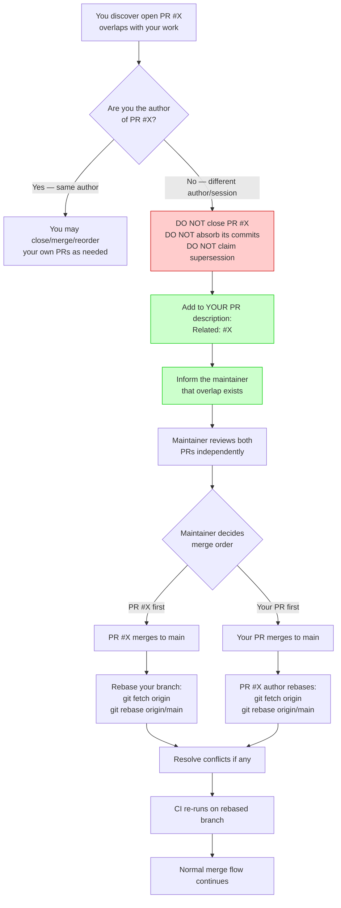

### Key Principles

- **PR sovereignty:** Every PR belongs to its author. Only the author or maintainer may close it.
- **No supersession claims:** Saying "my PR supersedes yours" is a judgment call reserved for the maintainer.
- **Report, don't act:** When an AI agent discovers overlap, it reports to the human — it does not take action on the other PR.
- **Independent review:** Overlapping PRs are reviewed independently. Neither is subordinate to the other.
- **Merge order:** The maintainer decides which PR merges first. The second PR rebases and resolves conflicts.
