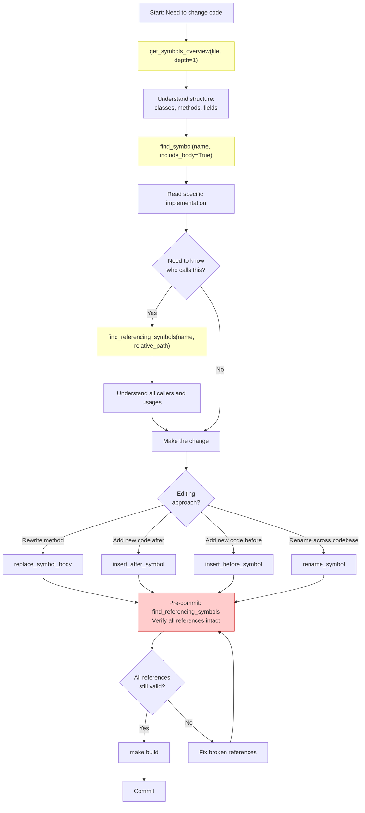

# Serena Code Intelligence Guide

Serena is the **mandatory** semantic code analysis tool for FreeMind CE. It provides LSP-powered symbol navigation, reference tracking, and impact analysis via MCP. Every code change — no matter how small — must start with Serena exploration and end with Serena verification.

> **This is not optional.** No code change may be committed without Serena verification. Every AI agent and subagent must use Serena as the first step of any analysis task.

---

## Why Serena?

| Capability | Value |
|-----------|-------|
| Symbol-level precision | Find all references to a method/class across ~130K lines |
| Impact analysis | Understand what breaks before you change anything |
| Semantic editing | Modify code at symbol level, not text search-and-replace |
| Token efficiency | Read only the symbols you need, not entire files |

---

## Mandatory Workflow



---

## Decision Tree: Which Tool to Use?

```mermaid
flowchart TD
    Start["What do I want to do?"] --> Q1

    Q1{Exploration\nor Editing?}
    Q1 -->|Explore| Q2
    Q1 -->|Edit| Q5
    Q1 -->|Memory| Q7
    Q1 -->|Setup| Q8

    Q2{"What kind\nof exploration?"}
    Q2 -->|Understand a file's structure| T1["get_symbols_overview\n(depth=1 for methods)"]
    Q2 -->|Read a specific method/class| T2["find_symbol\n(include_body=True)"]
    Q2 -->|Find who calls this method| T3["find_referencing_symbols"]
    Q2 -->|Search for a text/regex pattern| T4["search_for_pattern"]
    Q2 -->|Find a file by name| T5["find_file\n(file_mask='*.java')"]
    Q2 -->|Browse directory contents| T6["list_dir"]

    Q5{"What kind\nof edit?"}
    Q5 -->|Replace entire method body| T7["replace_symbol_body"]
    Q5 -->|Add code AFTER a symbol| T8["insert_after_symbol"]
    Q5 -->|Add code BEFORE a symbol| T9["insert_before_symbol"]
    Q5 -->|Rename across entire codebase| T10["rename_symbol"]

    Q7{"Memory\noperation?"}
    Q7 -->|Save project knowledge| T11["write_memory"]
    Q7 -->|Read saved knowledge| T12["read_memory"]
    Q7 -->|List available memories| T13["list_memories"]
    Q7 -->|Update saved knowledge| T14["edit_memory"]
    Q7 -->|Remove old memory| T15["delete_memory"]
    Q7 -->|Reorganize memory topic| T16["rename_memory"]

    Q8{"Setup?"}
    Q8 -->|Check if onboarding done| T17["check_onboarding_performed"]
    Q8 -->|Initialize project| T18["onboarding"]

    style T1 fill:#e6f3ff
    style T2 fill:#e6f3ff
    style T3 fill:#e6f3ff
    style T4 fill:#e6f3ff
    style T5 fill:#e6f3ff
    style T6 fill:#e6f3ff
    style T7 fill:#e6ffe6
    style T8 fill:#e6ffe6
    style T9 fill:#e6ffe6
    style T10 fill:#e6ffe6
```



---

## Complete Tool Reference (18 Tools)

### Category 1: Exploration & Analysis (6 tools)

| Tool | Purpose | Key Parameters |
|------|---------|----------------|
| `get_symbols_overview` | Get a file's class/method/field structure without reading the full file. **Always call this first** when exploring a new file. | `relative_path` (required), `depth` (0=top-level only, 1=include methods/fields of classes) |
| `find_symbol` | Locate a class, method, or field by name path pattern. Returns source body and/or hover info. | `name_path_pattern` (required), `include_body` (read source), `include_info` (docstring/signature), `depth`, `substring_matching`, `relative_path`, `include_kinds`/`exclude_kinds` |
| `find_referencing_symbols` | Find **all code that references a symbol** — callers, usages, imports. Returns snippets with symbolic metadata. **Critical for impact analysis before committing.** | `name_path` (required), `relative_path` (file path, required — must be a file not directory) |
| `search_for_pattern` | Regex search across the entire codebase including non-code files (XML, YAML, properties). Supports DOTALL (`.` matches newlines). | `substring_pattern` (regex, required), `relative_path`, `restrict_search_to_code_files`, `paths_include_glob`/`paths_exclude_glob`, `context_lines_before`/`context_lines_after` |
| `find_file` | Find files by name or wildcard mask (e.g., `*.java`, `*Controller*`). Only searches non-gitignored files. | `file_mask` (required), `relative_path` (required — use `.` for project root) |
| `list_dir` | List files and directories at a given path. | `relative_path` (required), `recursive` (required), `skip_ignored_files` |

### Category 2: Code Editing — Symbol-Level Precision (4 tools)

| Tool | Purpose | When to Use |
|------|---------|-------------|
| `replace_symbol_body` | Replace the **entire body** of a symbol (method, class, function). The body includes the signature line but NOT preceding comments or imports. | Rewriting an entire method or class. Always call `find_symbol(include_body=True)` first to read the current body. |
| `insert_after_symbol` | Insert new code **after** a symbol's closing brace. | Adding a new method after an existing one; appending code to end of file (use last top-level symbol). |
| `insert_before_symbol` | Insert new code **before** a symbol's definition. | Adding imports before the first symbol; inserting a new method before an existing one. |
| `rename_symbol` | Rename a symbol **across the entire codebase** using LSP rename. Handles all references atomically. For Java overloaded methods, include the signature in `name_path`. | Renaming a class, method, field, or variable. All references updated in one operation. |

### Category 3: Memory System — Project Knowledge Persistence (6 tools)

| Tool | Purpose | Example |
|------|---------|---------|
| `write_memory` | Save project knowledge to named memory files that persist across sessions. Use `/` for topic organization. Prefix with `global/` for cross-project memories. | `write_memory("auth/login_flow", "The login flow uses...")` |
| `read_memory` | Read a previously saved memory by name. Only read if relevant to current task. | `read_memory("suggested_commands")` |
| `list_memories` | List all available memories, optionally filtered by topic. | `list_memories(topic="auth")` |
| `edit_memory` | Edit memory content using literal string or regex replacement. | `edit_memory("overview", "old text", "new text", mode="literal")` |
| `delete_memory` | Delete a memory file. Use only when explicitly instructed to remove outdated knowledge. | `delete_memory("obsolete/old_info")` |
| `rename_memory` | Rename or move a memory to a different topic path. | `rename_memory("old_name", "new/organized_name")` |

### Category 4: Project Setup (2 tools)

| Tool | Purpose | When to Use |
|------|---------|-------------|
| `check_onboarding_performed` | Check if project onboarding has been completed. Call at the start of every new conversation. | Beginning of every session. |
| `onboarding` | Perform initial project setup — creates memory files with project overview, commands, conventions. | Once per project, or when onboarding check fails. |

### Category 5: Instructions (1 tool)

| Tool | Purpose |
|------|---------|
| `initial_instructions` | Load the initial instructions for the Serena session. Provides context on project conventions and tool usage. |

---

## Name Path Pattern Syntax

Serena identifies symbols within files using **name paths**. Understanding this syntax is essential for precise tool usage.

| Pattern Type | Syntax | Behavior |
|-------------|--------|----------|
| Simple name | `"setNoteText"` | Matches ANY symbol with that name anywhere in the project |
| Relative path | `"NodeAdapter/setNoteText"` | Matches any name path ending with this suffix |
| Absolute path | `"/NodeAdapter/setNoteText"` | Exact full path match from root |
| Overload index | `"MyClass/method[1]"` | Second overload (0-based index) of an overloaded method |
| Substring | `"Node/set"` + `substring_matching=True` | Matches `"Node/setText"`, `"Node/setLink"`, `"Node/setColor"`, etc. |

**Examples for this codebase:**

```
find_symbol("MindMapController")                          # any class named MindMapController
find_symbol("MindMapController/addNewNode")               # specific method
find_symbol("/freemind.modes.mindmapmode.MindMapController/addNewNode")  # fully qualified
find_symbol("Controller/get", substring_matching=True)   # all "get*" methods on Controller
```

---

## LSP Symbol Kinds

Use `include_kinds` or `exclude_kinds` in `find_symbol` to filter results by symbol type.

| Kind | Integer | Kind | Integer |
|------|---------|------|---------|
| File | 1 | Module | 2 |
| Namespace | 3 | Package | 4 |
| Class | 5 | Method | 6 |
| Property | 7 | Field | 8 |
| Constructor | 9 | Enum | 10 |
| Interface | 11 | Function | 12 |
| Variable | 13 | Constant | 14 |
| String | 15 | Number | 16 |
| Boolean | 17 | Array | 18 |

**Common usage:** `include_kinds=[5, 11]` to find only classes and interfaces; `exclude_kinds=[8]` to skip fields.

---

## Example Workflows

### Workflow 1: Understanding a Class Before Modifying It

```
# Step 1: Get class structure
get_symbols_overview("freemind/freemind/modes/NodeAdapter.java", depth=1)
→ See all methods, fields, inner classes

# Step 2: Read specific method body
find_symbol("NodeAdapter/setNoteText", include_body=True)
→ Read full implementation with signature

# Step 3: Find all callers before changing the signature
find_referencing_symbols("NodeAdapter/setNoteText",
    relative_path="freemind/freemind/modes/NodeAdapter.java")
→ See every call site with surrounding code

# Step 4: Make the change
replace_symbol_body("NodeAdapter/setNoteText", ..., body="new implementation")

# Step 5: Verify references still compile
find_referencing_symbols("NodeAdapter/setNoteText",
    relative_path="freemind/freemind/modes/NodeAdapter.java")
→ Confirm caller signatures match new implementation
```

### Workflow 2: Safe Renaming Across the Codebase

```
# Step 1: Find the symbol and its signature
find_symbol("MindMapController/addNewNode", include_info=True, include_body=True)
→ See current signature, javadoc, implementation

# Step 2: Assess impact before renaming
find_referencing_symbols("MindMapController/addNewNode",
    relative_path="freemind/freemind/modes/mindmapmode/MindMapController.java")
→ See all callers across all files (e.g., 47 references in 12 files)

# Step 3: Rename atomically across the entire codebase
rename_symbol("MindMapController/addNewNode", ..., new_name="createChildNode")
→ All 47 references updated automatically by LSP

# Step 4: Build to confirm no compilation errors
make build
```

### Workflow 3: Adding a New Method to an Existing Class

```
# Step 1: Understand current class structure
get_symbols_overview("freemind/freemind/main/HtmlTools.java", depth=1)
→ Identify last method name (e.g., "convertToHtml")

# Step 2: Read the last method to understand style/context
find_symbol("HtmlTools/convertToHtml", include_body=True)
→ Understand coding conventions in this class

# Step 3: Insert new method after the last one
insert_after_symbol("HtmlTools/convertToHtml",
    relative_path="freemind/freemind/main/HtmlTools.java",
    body="\n    public static String stripTags(String html) {\n        ...\n    }")

# Step 4: Verify placement
get_symbols_overview("freemind/freemind/main/HtmlTools.java", depth=1)
→ Confirm new method appears in expected position
```

### Workflow 4: Cross-Codebase Pattern Search

```
# Find all XML plugin descriptors that register a hook
search_for_pattern("hook_name=",
    paths_include_glob="**/*.xml",
    relative_path="freemind/accessories/plugins")

# Find all TODO/FIXME comments with context
search_for_pattern("TODO|FIXME",
    restrict_search_to_code_files=True,
    context_lines_after=2)

# Find usages of a class only in production code (not tests)
search_for_pattern("FreeMindMainMock",
    restrict_search_to_code_files=True,
    paths_exclude_glob="**/tests/**")

# Find multiline patterns (DOTALL mode)
search_for_pattern("try \\{[\\s\\S]*?catch",
    restrict_search_to_code_files=True,
    relative_path="freemind/freemind/main")
```

---

## Pre-Commit Verification Flow

```mermaid
flowchart TD
    A["Changes made"] --> B["make build\n(must pass)"]
    B --> C{Build\npassed?}
    C -->|No| D["Fix compilation errors"]
    D --> B
    C -->|Yes| E["For each modified symbol:\nfind_referencing_symbols(symbol, file)"]
    E --> F{Any broken\nreferences?}
    F -->|Yes| G["Fix broken callers/implementations"]
    G --> B
    F -->|No| H{Interface\ncontracts\npreserved?}
    H -->|No — signature changed| I["Update all callers\nand implementations"]
    I --> B
    H -->|Yes| J{Any orphaned\nreferences?\n(dead code from renames)}
    J -->|Yes| K["Remove dead references\nor update them"]
    K --> B
    J -->|No| L["make run\nVisual smoke test"]
    L --> M{UI changes\npresent?}
    M -->|Yes| N["Verify UI visually\nCheck log for SEVERE/WARNING"]
    N --> O["git diff --staged\nReview final diff"]
    M -->|No| O
    O --> P{Clean diff?\nNo debug code?\nNo secrets?}
    P -->|No| Q["Clean up staged changes"]
    Q --> O
    P -->|Yes| R["Commit"]

    style E fill:#ffffcc,stroke:#cccc00
    style F fill:#ffffcc,stroke:#cccc00
    style H fill:#ffffcc,stroke:#cccc00
```

---

## Anti-Patterns

| Do NOT do this | Do this instead | Why |
|----------------|----------------|-----|
| `cat NodeAdapter.java` or `Read` tool on a whole file | `get_symbols_overview` → `find_symbol(include_body=True)` for specific symbols | Wastes tokens; Serena reads only what you need |
| `grep -r "setNoteText" .` to find callers | `find_referencing_symbols` | Grep returns text matches; Serena returns semantic references with call-site context |
| Manually search-and-replace a rename in multiple files | `rename_symbol` | Manual rename misses references; `rename_symbol` is atomic and complete |
| Edit code with line-number-based text tools | `replace_symbol_body` | Line numbers shift; symbol bodies are stable even when surrounding code changes |
| Skip Serena for "trivial" changes | Always verify — use `find_referencing_symbols` | Interface contracts can break from one-line changes; Serena catches this |
| Commit without `find_referencing_symbols` | Run `find_referencing_symbols` on every modified symbol | Dead code, broken callers, and contract violations are invisible without it |
| Use `find_referencing_symbols` with a directory path | Provide the **file path** that defines the symbol | The `relative_path` parameter must be a file, not a directory |
| Use `write_memory` for temporary notes | Use it for durable project knowledge (architecture decisions, conventions, commands) | Memory persists across sessions — only write knowledge that stays relevant |

---

## Setup (One-Time Per Machine)

```bash
# 1. Install uv (Python package manager) if not already installed
curl -LsSf https://astral.sh/uv/install.sh | sh

# 2. Add Serena as MCP server for Claude Code (per-project)
claude mcp add serena -- uvx --from git+https://github.com/oraios/serena \
  serena start-mcp-server --context=claude-code --project-from-cwd

# 3. Index the codebase (recommended after major changes)
uvx --from git+https://github.com/oraios/serena serena project index .

# 4. Verify setup
uvx --from git+https://github.com/oraios/serena serena project health-check .
```

The project config (`.serena/project.yml`) is already versioned — no additional setup needed.

---

## Quick Reference Card

```
ALWAYS START WITH:
  get_symbols_overview(file, depth=1)     → understand structure
  find_symbol(name, include_body=True)    → read specific code

BEFORE EVERY COMMIT:
  find_referencing_symbols(name, file)    → verify impact

FOR EDITING:
  replace_symbol_body                     → rewrite a method
  insert_after_symbol                     → add code after
  insert_before_symbol                    → add code before
  rename_symbol                           → codebase-wide rename

FOR SEARCHING:
  search_for_pattern(regex)               → text/regex across all files
  find_file(mask, path)                   → find by filename
  list_dir(path, recursive)               → browse directory
```
